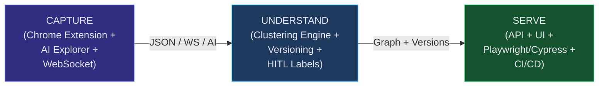
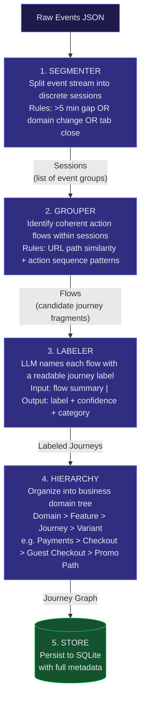
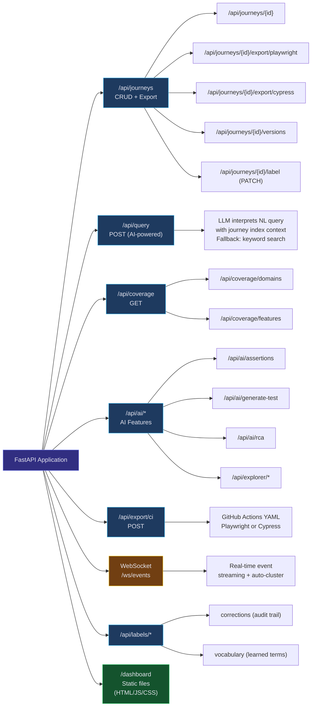
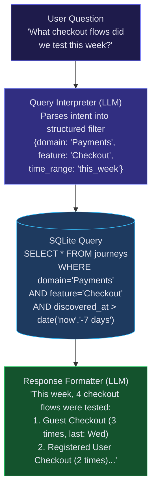
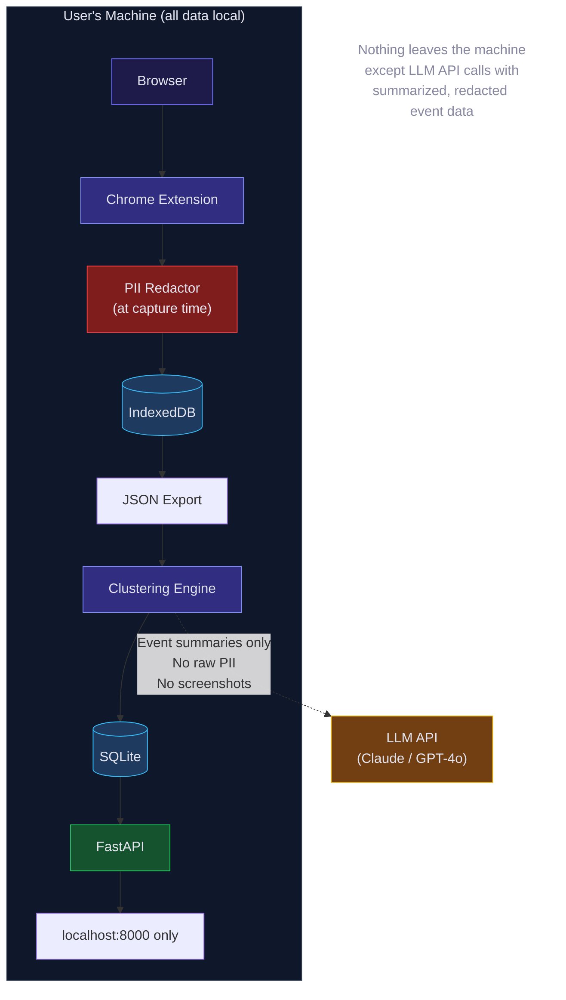
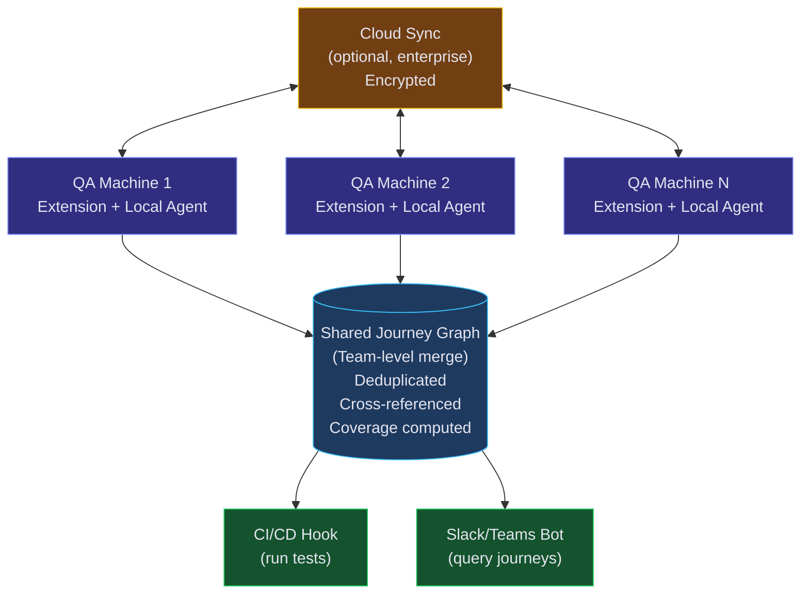

# Vigil — Technical Architecture

## System Overview

Vigil is a local-first system with three core components that operate as a pipeline:



**Design Principles**:
- **Local-first**: All data stays on the user's machine by default. No cloud required.
- **Privacy-by-design**: PII redaction at capture time, not after.
- **Pluggable LLM**: Works with Claude, GPT-4o, Gemini, or local models via LiteLLM.
- **Minimal infrastructure**: SQLite, not Postgres. Files, not S3. Simplicity over scale (for now).
- **Dual-framework export**: Playwright and Cypress from the same journey data.
- **CI/CD native**: Tests ship as GitHub Actions workflows with one click.

---

## Component 1: Capture Agent (Chrome Extension)

### Architecture

```mermaid
graph TD
    EXT["Chrome Extension\n(Manifest V3)"]

    EXT --> SW["Service Worker\n(background.ts)"]
    EXT --> CS["Content Script\n(content.ts)\nInjected per tab"]
    EXT --> POP["Popup\n(popup.ts)"]
    EXT --> STR["Storage"]

    SW --> SW1["Manages capture state\n(on/off/paused)"]
    SW --> SW2["Aggregates events\nfrom content scripts"]
    SW --> SW3["Coordinates screenshots\nvia chrome.debugger"]
    SW --> SW4["Writes to IndexedDB"]
    SW --> SW5["Handles daily\nexport scheduling"]

    CS --> CS1["MutationObserver\nfor DOM changes"]
    CS --> CS2["Event listeners:\nclick, input, submit, navigation"]
    CS --> CS3["Element fingerprinting\n(CSS, XPath, text, aria-label)"]
    CS --> CS4["PII scanner\non input values"]
    CS --> CS5["Posts events to\nService Worker"]

    POP --> POP1["On/Off toggle"]
    POP --> POP2["Domain allowlist manager"]
    POP --> POP3["Capture stats"]
    POP --> POP4["Manual export trigger"]

    STR --> STR1[("IndexedDB:\nraw events")]
    STR --> STR2["chrome.storage.local:\nsettings, allowlist"]
    STR --> STR3["Export:\nJSON file per day"]

    style EXT fill:#312e81,stroke:#818cf8,color:#e4e4ef
    style SW fill:#1e3a5f,stroke:#38bdf8,color:#e4e4ef
    style CS fill:#1e3a5f,stroke:#38bdf8,color:#e4e4ef
    style POP fill:#1e3a5f,stroke:#38bdf8,color:#e4e4ef
    style STR fill:#1e3a5f,stroke:#38bdf8,color:#e4e4ef
```



### Event Schema

```typescript
interface CapturedEvent {
  id: string;                    // UUID
  timestamp: number;             // Unix ms
  type: EventType;               // 'click' | 'input' | 'navigation' | 'scroll' | 'submit' | 'pageload'
  url: string;                   // Current page URL
  pageTitle: string;             // Document title

  // Element context (for click/input/submit)
  element?: {
    tagName: string;             // 'button', 'a', 'input', etc.
    selectors: {
      css: string;               // Unique CSS selector
      xpath: string;             // XPath
      text: string | null;       // Visible text content
      ariaLabel: string | null;  // Accessibility label
      testId: string | null;     // data-testid attribute
    };
    inputType?: string;          // 'text', 'email', 'password', etc.
    value?: string;              // REDACTED if PII detected
    coordinates: { x: number; y: number };
  };

  // Navigation context
  navigation?: {
    from: string;                // Previous URL
    to: string;                  // New URL
    trigger: 'click' | 'submit' | 'redirect' | 'back' | 'forward';
  };

  // Metadata
  tabId: number;
  sessionId: string;             // Groups events in same browsing session
  screenshotPath?: string;       // Local file reference
}
```

### PII Redaction Rules

Applied at capture time (before storage):

| Pattern | Example | Replacement |
|---|---|---|
| Email | `user@example.com` | `[EMAIL]` |
| Phone | `+1-555-123-4567` | `[PHONE]` |
| Credit card | `4111 1111 1111 1111` | `[CARD]` |
| SSN | `123-45-6789` | `[SSN]` |
| Password fields | any `<input type="password">` | `[REDACTED]` |
| Custom patterns | User-defined regex in settings | `[CUSTOM_PII]` |

---

## Component 2: Semantic Clustering Engine

### Pipeline Architecture



### Data Models (Pydantic)

```python
class Event(BaseModel):
    id: str
    timestamp: datetime
    type: Literal["click", "input", "navigation", "scroll", "submit", "pageload"]
    url: str
    page_title: str
    element_selector: str | None = None
    element_text: str | None = None
    input_value: str | None = None  # already redacted
    screenshot_path: str | None = None
    tab_id: int
    session_id: str

class Step(BaseModel):
    """A single meaningful action within a journey."""
    order: int
    description: str            # "Click 'Add to Cart' button on product page"
    events: list[str]           # Event IDs that comprise this step
    url: str
    action_type: str            # "click", "fill_form", "navigate", "verify"
    element_hint: str | None    # Human-readable element description

class Journey(BaseModel):
    """A named functional flow discovered from QA activity."""
    id: str
    name: str                   # "Guest Checkout with Promo Code"
    domain: str                 # "Payments"
    feature: str                # "Checkout"
    steps: list[Step]
    confidence: float           # 0.0 - 1.0, LLM self-assessed
    discovered_at: datetime
    discovered_by: str          # QA engineer identifier (anonymizable)
    session_id: str
    tags: list[str]             # ["checkout", "guest", "promo", "happy-path"]
    variant_of: str | None      # Parent journey ID if this is a variant
```

### LLM Prompting Strategy

The labeler uses structured output with a two-pass approach:

**Pass 1 — Journey Naming**:
```
Given the following sequence of QA interactions on a web application:

[Structured summary of events: URLs visited, elements clicked, forms filled]

Tasks:
1. Name this functional journey in 3-8 words (e.g., "Guest Checkout with Promo Code")
2. Identify the business domain (e.g., "Payments", "Authentication", "User Management")
3. Identify the feature area (e.g., "Checkout", "Login", "Profile Settings")
4. List the key steps as human-readable descriptions
5. Rate your confidence (0.0-1.0) that this label accurately describes the tester's intent
6. Suggest tags for this journey

Respond in JSON matching this schema: { ... }
```

**Pass 2 — Hierarchy Assignment** (runs after all journeys for the day are labeled):
```
Given these discovered journeys from today's QA activity:

[List of journey names + domains + features]

Organize them into a hierarchy:
- Group related journeys under shared features
- Identify variants of the same base journey
- Flag potential duplicates
- Suggest a domain → feature → journey tree

Respond in JSON matching this schema: { ... }
```

### Cost Estimation

| Scenario | Events/Day | LLM Calls | Est. Cost/Day |
|---|---|---|---|
| 1 QA, light testing | 200 events | 5-10 calls | ~$0.10 |
| 1 QA, heavy testing | 1,000 events | 20-30 calls | ~$0.50 |
| 5 QA team | 5,000 events | 100-150 calls | ~$2.50 |
| 20 QA team (enterprise) | 20,000 events | 400-600 calls | ~$10.00 |

*Based on Claude Haiku / GPT-4o-mini pricing. Drops 5-10x with local models.*

---

## Component 3: Query & Export Service

### API Architecture



### Natural Language Query Flow



### Test Export Templates

**Playwright Export Example** (from a journey):

```python
# Auto-generated by Vigil
# Journey: Guest Checkout with Promo Code
# Discovered: 2026-02-21 by qa_engineer_1
# Confidence: 0.87

import pytest
from playwright.sync_api import Page, expect

def test_guest_checkout_with_promo_code(page: Page):
    """Replay of journey: Guest Checkout with Promo Code"""

    # Step 1: Navigate to product catalog
    page.goto("https://example.com/products")
    expect(page).to_have_title("Products | Example Store")

    # Step 2: Select product
    page.click("[data-testid='product-card']:first-child")
    expect(page.locator("h1.product-title")).to_be_visible()

    # Step 3: Add to cart
    page.click("button:has-text('Add to Cart')")
    expect(page.locator(".cart-badge")).to_have_text("1")

    # Step 4: Proceed to checkout
    page.click("a:has-text('Checkout')")

    # Step 5: Apply promo code
    page.fill("[name='promoCode']", "SAVE20")
    page.click("button:has-text('Apply')")
    expect(page.locator(".discount-applied")).to_be_visible()

    # Step 6: Complete guest checkout
    page.fill("[name='email']", "test@example.com")
    page.fill("[name='firstName']", "Test")
    page.fill("[name='lastName']", "User")
    page.click("button:has-text('Place Order')")
    expect(page.locator(".order-confirmation")).to_be_visible()
```

### Self-Healing Selector Strategy

Each element is captured with multiple selector strategies, tried in priority order:

```python
SELECTOR_PRIORITY = [
    "data-testid",    # Most stable: data-testid='submit-btn'
    "aria-label",     # Accessibility: [aria-label='Submit order']
    "role+text",      # Semantic: button:has-text('Submit')
    "css_unique",     # Generated: #checkout-form > .actions > button:nth-child(2)
    "xpath",          # Fallback: //button[contains(text(),'Submit')]
    "coordinates",    # Last resort: click at (450, 320) — used only with visual verify
]
```

If the primary selector fails during replay, the system cascades through alternatives. If all fail, it flags the step for human review rather than failing silently.

---

## Database Schema (SQLite)

```sql
CREATE TABLE events (
    id TEXT PRIMARY KEY,
    timestamp INTEGER NOT NULL,
    type TEXT NOT NULL,
    url TEXT NOT NULL,
    page_title TEXT,
    element_selector TEXT,
    element_text TEXT,
    input_value TEXT,
    screenshot_path TEXT,
    tab_id INTEGER,
    session_id TEXT NOT NULL,
    created_at INTEGER DEFAULT (strftime('%s', 'now'))
);

CREATE TABLE journeys (
    id TEXT PRIMARY KEY,
    name TEXT NOT NULL,
    domain TEXT,
    feature TEXT,
    confidence REAL,
    discovered_at INTEGER NOT NULL,
    discovered_by TEXT,
    session_id TEXT,
    variant_of TEXT REFERENCES journeys(id),
    tags TEXT,  -- JSON array
    created_at INTEGER DEFAULT (strftime('%s', 'now')),
    updated_at INTEGER DEFAULT (strftime('%s', 'now'))
);

CREATE TABLE steps (
    id TEXT PRIMARY KEY,
    journey_id TEXT NOT NULL REFERENCES journeys(id),
    step_order INTEGER NOT NULL,
    description TEXT NOT NULL,
    url TEXT,
    action_type TEXT,
    element_hint TEXT,
    selectors TEXT,  -- JSON object with multiple selector strategies
    created_at INTEGER DEFAULT (strftime('%s', 'now'))
);

CREATE TABLE step_events (
    step_id TEXT NOT NULL REFERENCES steps(id),
    event_id TEXT NOT NULL REFERENCES events(id),
    PRIMARY KEY (step_id, event_id)
);

CREATE TABLE test_runs (
    id TEXT PRIMARY KEY,
    journey_id TEXT NOT NULL REFERENCES journeys(id),
    status TEXT NOT NULL,         -- 'pass', 'fail', 'error'
    base_url TEXT,
    duration_ms INTEGER,
    steps_total INTEGER,
    steps_passed INTEGER,
    healed INTEGER DEFAULT 0,
    error_message TEXT,
    created_at INTEGER DEFAULT (strftime('%s', 'now'))
);

-- Journey Versioning: tracks step changes over time
CREATE TABLE journey_versions (
    id INTEGER PRIMARY KEY AUTOINCREMENT,
    journey_id TEXT NOT NULL REFERENCES journeys(id),
    version INTEGER NOT NULL,
    step_hash TEXT NOT NULL,      -- content hash of steps for change detection
    step_count INTEGER NOT NULL,
    steps_json TEXT NOT NULL,     -- snapshot of steps at this version
    diff_json TEXT,               -- {added: [...], removed: [...]} vs previous version
    created_at TEXT DEFAULT (datetime('now'))
);

-- Human-in-the-Loop Label Corrections: audit trail for manual edits
CREATE TABLE label_corrections (
    id INTEGER PRIMARY KEY AUTOINCREMENT,
    journey_id TEXT NOT NULL REFERENCES journeys(id),
    field TEXT NOT NULL,          -- 'name', 'domain', 'feature', 'tags'
    old_value TEXT,
    new_value TEXT NOT NULL,
    corrected_by TEXT DEFAULT 'dashboard',
    created_at TEXT DEFAULT (datetime('now'))
);

-- AI Explorer Sessions
CREATE TABLE explorer_sessions (
    id TEXT PRIMARY KEY,
    base_url TEXT NOT NULL,
    status TEXT DEFAULT 'running', -- 'running', 'stopped', 'completed', 'error'
    pages_visited INTEGER DEFAULT 0,
    actions_taken INTEGER DEFAULT 0,
    flows_discovered INTEGER DEFAULT 0,
    config TEXT,                   -- JSON config object
    created_at TEXT DEFAULT (datetime('now')),
    finished_at TEXT
);

CREATE INDEX idx_events_session ON events(session_id);
CREATE INDEX idx_events_timestamp ON events(timestamp);
CREATE INDEX idx_journeys_domain ON journeys(domain);
CREATE INDEX idx_journeys_feature ON journeys(feature);
CREATE INDEX idx_journeys_discovered ON journeys(discovered_at);
CREATE INDEX idx_steps_journey ON steps(journey_id);
CREATE INDEX idx_test_runs_journey ON test_runs(journey_id);
CREATE INDEX idx_journey_versions_journey ON journey_versions(journey_id);
CREATE INDEX idx_label_corrections_journey ON label_corrections(journey_id);
```

---

## Security & Privacy Architecture



**Key privacy guarantees**:
- All storage is local (IndexedDB + SQLite on user's filesystem)
- PII is redacted at the moment of capture, before storage
- LLM API calls send event summaries, not raw data or screenshots
- Screenshots never leave the machine
- Domain allowlist means only approved sites are captured
- User can delete all data at any time via extension settings
- No telemetry, no analytics, no phone-home (MVP)

---

## Performance Budgets

| Metric | Budget | Measurement |
|---|---|---|
| Extension CPU overhead | <2% average | Chrome Task Manager during normal browsing |
| Extension memory | <50MB | Chrome Task Manager |
| Event capture latency | <5ms per event | No perceptible delay to user |
| Screenshot capture | <100ms per screenshot | Async, non-blocking |
| Daily storage (events) | <10MB per QA per day | IndexedDB size |
| Clustering batch time | <60s for 1,000 events | Wall clock time |
| Query response time | <3s for NL queries | API response time |
| Dashboard load time | <1s | Time to interactive |

---

## Future Architecture (Phase 3+)


