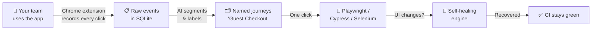
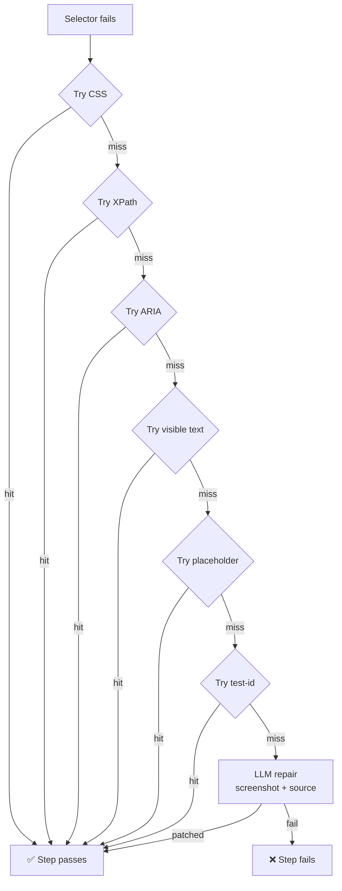

# Vigil

**Your team records itself. AI writes the tests.**

Vigil is an open-source passive QA tool. A Chrome extension silently captures your team's browser sessions. A local AI pipeline clusters them into named user journeys and generates self-healing Playwright tests — no authoring, no selectors, no flaky CI.

```
Browse your app → Vigil captures it → AI names the journey → Tests generated → Selectors self-heal
```

---

## How it works

1. **Capture** — Chrome extension records every click, navigation, and form fill from your team's sessions. Input values (passwords, emails) are redacted at capture time. Only allowlisted domains are captured.

2. **Cluster** — A local AI pipeline segments events into sessions, groups them into flows, and labels each one: *"Guest Checkout with Promo Code"*, *"Password Reset Flow"*, *"Admin Bulk Import"*.

3. **Export** — One click generates a Playwright test suite. Steps use a 6-strategy selector cascade (CSS → XPath → ARIA → text → placeholder → test-id) so tests survive routine UI changes.

4. **Heal** — When a selector fails at replay, Vigil tries the cascade in order. Last resort: screenshot + test source sent to an LLM to get a patched function back. The test continues. No human needed.



---

## Quick start

```bash
# Backend
cd backend
python -m venv .venv && source .venv/bin/activate
pip install -r requirements.txt
python -m testai server        # → http://127.0.0.1:8000
```

Log in with the admin credentials printed on first run (also saved to `~/.vigil/admin.passwd`).

**No extension? Run the demo:**

```bash
python -m testai demo           # offline clustering, no LLM needed
python -m testai demo-showcase  # 3 apps, 12 journeys
```

**Chrome extension:**

1. `chrome://extensions/` → enable Developer mode
2. Load unpacked → select the `extension/` folder
3. Open the extension popup → add your site to the allowlist → browse

---

## Self-healing selector cascade

When a test step fails, Vigil tries 6 strategies before giving up:

```
1. CSS selector       – what was captured
2. XPath              – structural fallback
3. ARIA role + label  – get_by_role("button", name="Submit")
4. Visible text       – get_by_text("Submit")
5. Placeholder        – get_by_placeholder("Search...")
6. test-id attrs      – data-testid, data-cy, data-qa (7 variants)
7. LLM repair         – screenshot + source → patched function
```

Real example from a Wikipedia run:

```
[step 2] fill: #searchInput → TimeoutError
[heal]   XPath //input[@type="search"] → not found
[heal]   ARIA get_by_role("searchbox") → FOUND ✓
```



---

## Dashboard

The web dashboard at `http://127.0.0.1:8000` shows captured journeys, lets you approve or correct them, replay any journey against any URL, and export test suites.

| Section | What it does |
|---------|-------------|
| Journeys | Browse, filter, review AI-named journeys |
| Replay | Run any journey against staging, localhost, or prod |
| Review queue | Approve/reject/correct auto-discovered flows (HITL) |
| Explorer | Autonomous agent that crawls your app to discover flows |
| Settings | LLM provider, allowlist, credential vault |
| CI Export | One-click GitHub Actions workflow |

---

## Privacy & security

- **Local-first** — all data stays on your machine (SQLite + IndexedDB). No cloud required.
- **Input redaction** — passwords, emails, phone numbers, card numbers → `[REDACTED]` at capture time. URLs and page titles are stored unredacted; server-side URL redaction is [planned](docs/PILOT_PLAN.md).
- **LLM** — Ollama (local) is the default. Cloud providers (OpenAI, Anthropic, Google) are opt-in. When enabled, event summaries including URLs and page titles are sent; raw values are not.
- **Auth** — Bearer token auth on all API endpoints. Secret loaded from `VIGIL_SECRET_KEY` env or auto-generated into `~/.vigil/secret` (0600).
- **Allowlist** — empty allowlist captures nothing (fail-closed).
- **No telemetry** — zero phone-home.

---

## LLM providers

| Provider | Notes |
|----------|-------|
| Ollama | Free, local. Qwen 2.5, Llama 3, CodeLlama |
| OpenAI | GPT-4o, GPT-4o Mini |
| Anthropic | Claude Sonnet, Haiku |
| Google | Gemini 2.0 Flash |
| OpenRouter | 200+ models |

Configure via the dashboard Settings page or `~/.vigil/llm.json`.

---

## Project layout

```
vigil/
  backend/testai/
    cluster/       # journey segmentation + labeling
    healing/       # 6-strategy selector cascade + LLM repair
    export/        # Playwright, Cypress, Selenium exporters
    explorer/      # autonomous site crawler
    hitl/          # human-in-the-loop review & learning
    routes/        # FastAPI API (auth-gated)
    storage/       # SQLite
    server.py
  dashboard/       # HTML/JS/CSS web UI
  extension/       # Chrome Manifest V3 extension
  docs/
    PILOT_PLAN.md
    diagrams/      # architecture diagrams + PNGs
```

---

## Status

Early-stage open source. Core pipeline works end-to-end — validated on GitHub, Wikipedia, and Hacker News. Not production-hardened. Actively seeking feedback from QA engineers and SDETs.

See [PILOT_PLAN.md](docs/PILOT_PLAN.md) for the roadmap and what's being worked on next.

---

## Contributing

```bash
cd backend
python -m venv .venv && source .venv/bin/activate
pip install -r requirements.txt
python -m testai server --reload
```

Areas where help is most useful: Firefox extension port, better journey segmentation, visual regression diff engine, getting-started guides.

---

## License

MIT — see [LICENSE](LICENSE).
