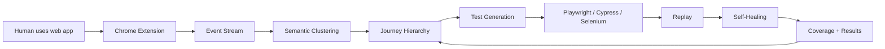

<p align="center">
  <h1 align="center">Vigil</h1>
  <p align="center"><strong>Observe real user behavior. Discover journeys. Generate self-healing tests.</strong></p>
  <p align="center">Open-source, local-first QA capture and AI test automation for web applications.</p>
</p>

<p align="center">
  <a href="#quick-start">Quick Start</a> &bull;
  <a href="#how-it-works">How It Works</a> &bull;
  <a href="#self-healing-replay">Self-Healing</a> &bull;
  <a href="ARCHITECTURE.md">Architecture</a>
</p>

---

## The idea

**Let the team generate the specification by using the product normally.**

Vigil captures real browser interactions, turns noisy event streams into meaningful user journeys, generates executable tests, replays them, and attempts to repair broken selectors when the UI changes.

### Product loop


**Capture → Understand → Generate → Replay → Heal → repeat.**

---

## Quick Start

```bash
git clone https://github.com/raphy78626/vigil.git
cd vigil/backend
python -m venv venv
source venv/bin/activate
pip install -r requirements.txt
python -m uvicorn testai.server:app --reload --port 8000
```

Open `http://localhost:8000` for the dashboard.

### Chrome extension

1. Open `chrome://extensions/`
2. Enable **Developer mode**
3. Click **Load unpacked**
4. Select the `extension/` directory
5. Browse an allowed web app — Vigil captures interactions automatically.

---

## How It Works



### Capture

The Manifest V3 extension observes browser activity such as clicks, inputs, navigation, and relevant DOM context. PII-sensitive input values are redacted at capture time.

### Understand

Raw events are segmented and grouped into meaningful journeys using URL similarity, action patterns, and optional LLM labeling. Journeys are organized as **Domain → Feature → Journey → Variant**.

### Generate

Journeys become executable tests for supported frameworks, with assertions and reusable step information.

### Replay

Tests run against the target application locally or in CI. Results, failures, screenshots, and healing attempts are recorded.

---

## Self-Healing Replay

When a selector fails, Vigil uses an ordered recovery cascade instead of immediately failing the test:

```text
1. CSS selector
2. XPath
3. ARIA role + label
4. Visible text
5. Placeholder text
6. test-id variants
7. nth-of-type
8. LLM repair
```

The important design choice is **deterministic recovery first, AI last**. LLM repair is a fallback rather than the primary mechanism, reducing unnecessary model calls and making healing easier to reason about.

---

## Features

| Feature | Description |
|---|---|
| Passive Capture | Record browser interactions without manually authoring tests |
| Journey Discovery | Cluster noisy events into meaningful user journeys |
| Self-Healing | Recover broken selectors through a deterministic cascade + LLM fallback |
| Multi-Framework Export | Playwright, Cypress, Selenium |
| AI Explorer | Autonomous exploration for discovering additional flows |
| HITL Review | Human review and correction of discovered journeys |
| Visual Regression | Screenshot comparison at replay steps |
| Natural Language Query | Query captured journeys and results in natural language |
| CI/CD Export | Generate CI-ready test workflows |
| Local-First | SQLite + local browser storage; cloud services are optional |
| Pluggable LLM | Local Ollama or cloud model providers |

---

## Privacy & Security

Vigil is designed **local-first and privacy-by-design**.

- Browser event data is stored locally.
- Passwords, emails, phone numbers, card numbers, and other configured sensitive inputs can be redacted during capture.
- Local Ollama can be used without sending prompts to a cloud LLM provider.
- Cloud LLM providers are opt-in and should be treated as an external data boundary.
- Domain allowlisting can restrict which sites are captured.
- No telemetry or phone-home behavior is intended.

> Local-first does not mean zero egress when a cloud LLM provider is explicitly enabled. Review your provider configuration before capturing sensitive applications.

---

## Project Structure

```text
vigil/
├── backend/
│   └── testai/
│       ├── capture/       # Event capture and processing
│       ├── cluster/       # Journey clustering and suite generation
│       ├── healing/       # Selector healing
│       ├── explorer/      # Autonomous exploration
│       ├── export/        # Test framework exporters
│       ├── llm/           # LLM provider abstraction
│       ├── models/        # Event and journey models
│       ├── storage/       # SQLite persistence
│       └── server.py      # FastAPI application
├── dashboard/             # Web dashboard
├── extension/             # Chrome Manifest V3 extension
└── docs/diagrams/         # Architecture/workflow diagrams
```

---

## Project Status

Vigil is **early-stage open source**. The core capture → cluster → test generation → replay → self-healing loop is implemented, but the project is not yet positioned as production-hardened enterprise QA infrastructure.

The project is actively looking for feedback, contributors, and real-world validation.

---

## Contributing

Useful areas for contribution include:

- Browser support, including Firefox
- Additional test framework exporters
- Better journey segmentation and clustering
- More robust selector healing
- Visual regression improvements
- Documentation and examples
- CI/CD integrations

---

## License

MIT — see [LICENSE](LICENSE).
