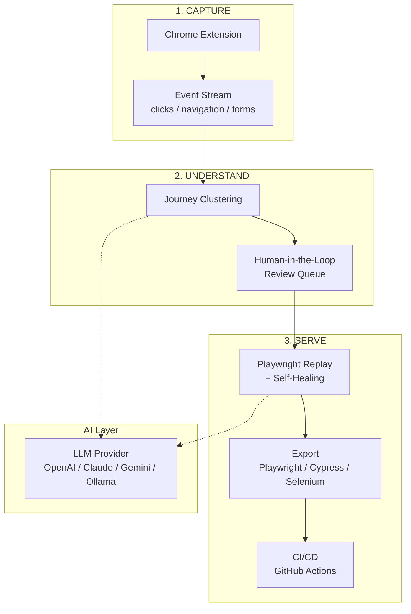

<p align="center">
  <h1 align="center">Vigil</h1>
  <p align="center"><strong>Open-source passive QA capture &amp; AI test automation</strong></p>
  <p align="center">
    Watch real users. Let AI write the tests.
  </p>
</p>

<p align="center">
  <a href="#quick-start">Quick Start</a> &bull;
  <a href="#how-it-works">How It Works</a> &bull;
  <a href="#features">Features</a> &bull;
  <a href="ARCHITECTURE.md">Architecture</a> &bull;
  <a href="#contributing">Contributing</a>
</p>

---

## What Is Vigil?

Vigil passively captures real user behavior through a Chrome extension, clusters interactions into meaningful journeys using AI, and generates self-healing Playwright tests that adapt when UI changes.

**No test scripts to write. No selectors to maintain. No flaky tests.**

```
You browse your app normally
        ↓
Vigil's Chrome extension silently records every click, navigation, and form fill
        ↓
AI clusters raw events into named user journeys ("Guest Checkout with Promo Code")
        ↓
One click → runnable Playwright/Cypress/Selenium tests with self-healing selectors
```

### Why Vigil?

| Problem | Vigil's Approach |
|---------|-----------------|
| Writing E2E tests is slow | Tests are generated from observed behavior — zero authoring |
| Tests break when UI changes | Self-healing engine cascades through 6 selector strategies + LLM repair |
| You don't know what to test | AI discovers journeys from real usage patterns |
| Test data is PII-sensitive | PII redacted at capture time, before storage. Local-first — nothing leaves your machine |

---

## Quick Start

### 1. Start the Backend

```bash
cd backend
pip install -r requirements.txt
python -m uvicorn testai.server:app --port 8000
```

Open http://localhost:8000 for the dashboard.

### 2. Run a Demo (No Extension Needed)

```bash
cd backend
python -m testai demo                  # Quick demo with local clustering
python -m testai demo --use-llm        # Demo with LLM-powered labeling
python -m testai demo-showcase         # Rich showcase (3 apps, 12 journeys)
```

### 3. Install the Chrome Extension

1. Open `chrome://extensions/`
2. Enable **Developer mode**
3. Click **Load unpacked** → select the `extension/` folder
4. Browse any web app — events are captured automatically

---

## How It Works



### The Pipeline

1. **Capture** — Chrome extension records clicks, navigations, form fills, and scrolls with full element context (CSS, XPath, ARIA, text, testId selectors)
2. **Cluster** — AI segments raw events into sessions, groups coherent action flows, and labels each journey with a human-readable name and confidence score
3. **Review** — Auto-discovered journeys enter a Human-in-the-Loop queue. High-confidence journeys are auto-approved; borderline ones await human review
4. **Replay** — Journeys are replayed as Playwright tests. When selectors break, the self-healing engine cascades through 6 strategies including LLM-powered repair
5. **Export** — Generate runnable test files for Playwright, Cypress, or Selenium. One-click GitHub Actions CI/CD workflow export

---

## Features

| Feature | Description |
|---------|-------------|
| **Passive Capture** | Chrome extension silently records user interactions — no test authoring |
| **Journey Discovery** | AI clusters events into meaningful, named test flows |
| **Self-Healing Tests** | 6-strategy selector cascade + LLM repair when UI changes |
| **Multi-Framework Export** | Playwright, Cypress, Selenium test generation |
| **Visual Regression** | Pixel-diff screenshot comparison per step |
| **AI Explorer** | Autonomous agent that crawls your app and discovers test flows |
| **HITL Review Queue** | Approve, reject, or correct auto-discovered journeys |
| **Scheduled Monitoring** | Cron-based production test runs with alerts |
| **Flaky Test Detection** | Identify inconsistent pass/fail patterns |
| **Natural Language Query** | Ask "What checkout flows did we test this week?" |
| **CI/CD Export** | One-click GitHub Actions workflow generation |
| **Local-First** | All data stays on your machine. No cloud required |
| **Pluggable LLM** | OpenAI, Anthropic, Google, Ollama (free local models) |
| **Slack Integration** | Alert notifications and `/vigil` slash commands |

---

## Privacy & Security

Vigil is **local-first by design**:

- All data stored locally (IndexedDB + SQLite)
- PII redacted at capture time (emails, phones, cards, passwords → `[REDACTED]`)
- LLM calls send event summaries only — no raw data or screenshots
- Domain allowlist — only approved sites are captured
- No telemetry, no analytics, no phone-home
- Delete all data anytime via extension settings

---

## LLM Providers

| Provider | Models | Cost |
|----------|--------|------|
| **Ollama** | Qwen 2.5, Llama 3, CodeLlama | Free (local) |
| **OpenAI** | GPT-4o, GPT-4o Mini | Pay-per-use |
| **Anthropic** | Claude Sonnet, Haiku | Pay-per-use |
| **Google** | Gemini 2.0 Flash, 1.5 Pro | Pay-per-use |
| **OpenRouter** | 200+ models | Varies |

Configure via the dashboard Settings page or `~/.vigil/llm.json`.

---

## API Reference

| Method | Endpoint | Description |
|--------|----------|-------------|
| POST | `/api/ingest` | Ingest captured events |
| GET | `/api/journeys` | List discovered journeys |
| GET | `/api/journeys/{id}` | Journey with steps |
| POST | `/api/journeys/{id}/replay` | Replay a journey |
| GET | `/api/runs` | List test runs |
| POST | `/api/query` | Natural language query |
| POST | `/api/ai/assertions` | AI-generated assertions |
| POST | `/api/ai/generate-test` | Generate test from description |
| GET | `/api/ai/rca` | Root cause analysis |
| GET | `/api/reviews` | Review queue |
| PATCH | `/api/reviews/{id}/approve` | Approve a journey |

Full interactive docs at http://localhost:8000/docs (Swagger UI).

---

## Project Structure

```
vigil/
  backend/
    testai/
      api_testing/     # HTTP API test runner
      audit/           # AI site audit
      capture/         # Rich event processing, Shadow DOM
      cluster/         # Journey clustering, noise filter, suite gen
      credentials/     # Auth credential management
      explorer/        # Autonomous site explorer agent
      export/          # Playwright, Cypress, Selenium exporters
      healing/         # Self-healing selector engine (6 strategies)
      hitl/            # Human-in-the-loop review & learning
      integrations/    # Slack bot
      llm/             # LLM provider abstraction
      models/          # Event, Journey, Step data models
      monitoring/      # Scheduled test monitoring
      routes/          # FastAPI API routes
      storage/         # SQLite database
      visual/          # Visual regression testing
      server.py        # FastAPI application
    requirements.txt
  dashboard/           # Web dashboard (HTML/JS/CSS)
  extension/           # Chrome extension (Manifest V3)
  docs/
    diagrams/          # Excalidraw architecture diagrams
```

---

## Contributing

Contributions are welcome! Areas where help is especially appreciated:

- **Browser support** — Firefox extension port
- **Test framework exports** — TestCafe, WebdriverIO, Robot Framework
- **Clustering quality** — Better journey segmentation algorithms
- **Visual regression** — More robust diff engine
- **Docs & examples** — Getting started guides, video walkthroughs

```bash
# Development setup
cd backend
python -m venv venv
source venv/bin/activate
pip install -r requirements.txt
python -m uvicorn testai.server:app --reload --port 8000
```

---

## License

MIT — see [LICENSE](LICENSE).
