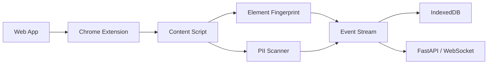
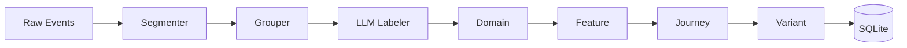
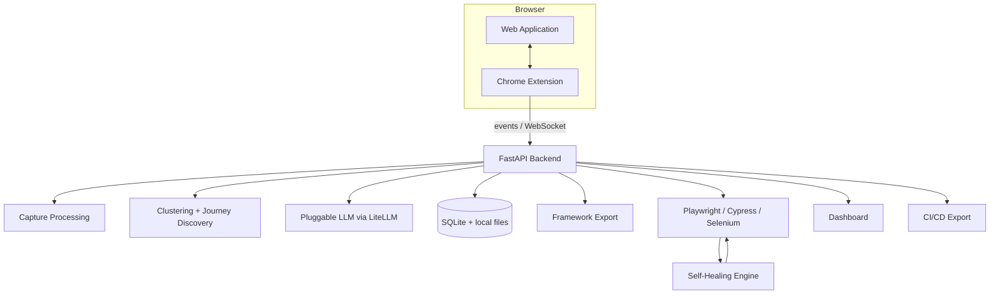

<p align="center">
  <h1 align="center">Vigil</h1>
  <p align="center"><strong>Observe real user behavior. Discover journeys. Generate self-healing tests.</strong></p>
  <p align="center">Open-source, local-first QA capture and AI test automation for web applications.</p>
</p>

<p align="center">
  <a href="#quick-start">Quick Start</a> &bull;
  <a href="#how-it-works">How It Works</a> &bull;
  <a href="#self-healing-replay">Self-Healing</a> &bull;
  <a href="ARCHITECTURE.md">Architecture</a>
</p>

---

## The idea

**Let the team generate the specification by using the product normally.**

Vigil captures real browser interactions, turns noisy event streams into meaningful user journeys, generates executable tests, replays them, and attempts to repair broken selectors when the UI changes.

```text
Human behavior
      |
      v
[ CAPTURE ]  Chrome Extension + Event Stream
      |
      v
[ UNDERSTAND ]  Segment + Cluster + Label
      |
      v
[ GENERATE ]  Playwright / Cypress / Selenium
      |
      v
[ REPLAY ]  Execute + Observe failures
      |
      v
[ HEAL ]  Selector recovery + LLM repair
      |
      +---------------------> Coverage / feedback
```

### Why Vigil?

| Traditional E2E workflow | Vigil |
|---|---|
| Engineers manually author flows | Journeys are discovered from observed behavior |
| Selectors are hand-maintained | Replay uses an ordered recovery cascade |
| Coverage depends on what someone remembered to test | Real usage exposes important journeys |
| UI changes create repetitive maintenance | Self-healing attempts recovery before failing |
| Test data can leak into capture | PII is redacted at capture time |

> **Important:** Vigil is early-stage open source, not a claim of zero-maintenance or production-perfect automation. Self-healing is best-effort and should be reviewed like any generated test.

---

## Project status

**Early-stage open source.** The core capture → cluster → Playwright export → self-healing replay path works and has been validated against demo applications and real sites including GitHub, Wikipedia, and Hacker News. The project is not yet production-hardened and has no external pilot users.

A real-site validation run reported **6/6 journeys passing**; one Wikipedia search flow demonstrated ARIA recovery after the original CSS selector failed.

---

## How it works

### 1. Capture — observe behavior

The Manifest V3 Chrome extension records browser interaction events while the user works normally. It uses DOM observation and browser events to capture clicks, inputs, submits, navigation and useful element context.

Capture is designed to be local-first and fail-closed when no domains are allowlisted.



A captured event can contain timestamp, action type, URL, page title, element fingerprint, navigation/tab/session context and an optional screenshot path.

### 2. Understand — turn events into journeys

Raw events are segmented around meaningful boundaries such as time gaps, domain changes and tab/session transitions. The clustering pipeline then groups related actions using URL similarity and action patterns, and can ask an LLM to produce human-readable labels.

The resulting hierarchy is:

```text
Domain
  └── Feature
       └── Journey
            └── Variant
                 └── Steps
```



### 3. Generate — make the journey executable

Journeys can be exported into runnable automation for Playwright, Cypress and Selenium. The goal is not merely to generate code, but to preserve the observed intent as an executable regression flow.

### 4. Replay — run the flow

The generated test replays the recorded steps against the application. A failed selector does not immediately become a failed journey: the healing engine gets a chance to recover it.

### 5. Heal — recover from UI drift

The recovery cascade is deliberately ordered from deterministic signals to increasingly heuristic strategies. This keeps the common path fast and makes LLM repair the last resort rather than the default.

---

## Self-healing replay

When a selector fails, Vigil attempts these strategies in order:

```text
1. CSS selector
       |
       v
2. XPath
       |
       v
3. ARIA role + accessible label
       |
       v
4. Visible text
       |
       v
5. Placeholder text
       |
       v
6. Test-id variants
       |
       v
7. nth-of-type positional fallback
       |
       v
8. LLM repair
```

Example:

```text
[step] fill #searchInput
       -> TimeoutError

[heal] XPath
       -> not found

[heal] ARIA searchbox
       -> FOUND

[healed] continue with recovered element
```

The recovered selector is logged for observability; the baseline selector remains the first attempt on the next run so a temporary DOM quirk does not silently rewrite the test forever.

### Design principle

**Deterministic recovery first. AI recovery last.**

That distinction matters: an LLM can be useful for ambiguous DOM changes, but it should not be trusted as the first mechanism for every selector.

---

## Runtime architecture



See [`ARCHITECTURE.md`](ARCHITECTURE.md) for the deeper design, data flow and component boundaries.

---

## Core components

| Area | Responsibility |
|---|---|
| **Chrome Extension** | Capture browser behavior and element context |
| **Capture pipeline** | Normalize events, filter noise and redact sensitive values |
| **Clustering engine** | Segment sessions and discover semantic journeys |
| **Journey store** | Persist domains, features, journeys, variants and steps |
| **Exporters** | Generate Playwright, Cypress and Selenium automation |
| **Healing engine** | Recover failed selectors using ordered strategies |
| **AI Explorer** | Autonomously explore applications and discover flows |
| **HITL queue** | Review, approve, reject or correct discovered journeys |
| **Visual regression** | Compare screenshots and detect visual drift |
| **Monitoring** | Schedule test runs and surface failures |
| **Dashboard/API** | Query journeys, runs, reviews and AI capabilities |

---

## Quick start

### 1. Start the backend

```bash
git clone https://github.com/raphy78626/vigil.git
cd vigil/backend
python -m venv venv
source venv/bin/activate
pip install -r requirements.txt
python -m uvicorn testai.server:app --reload --port 8000
```

Open `http://localhost:8000` for the dashboard and `http://localhost:8000/docs` for Swagger UI.

### 2. Run a demo

```bash
python -m testai demo
python -m testai demo --use-llm
python -m testai demo-showcase
```

### 3. Install the Chrome extension

1. Open `chrome://extensions/`.
2. Enable **Developer mode**.
3. Choose **Load unpacked**.
4. Select the repository's `extension/` directory.
5. Add the target domain to the capture allowlist.
6. Browse the application normally.

---

## Features

| Feature | What it does |
|---|---|
| **Passive capture** | Records real browser interactions without test authoring |
| **Journey discovery** | Converts raw events into named user flows |
| **Self-healing tests** | Uses an 8-stage selector recovery cascade |
| **Multi-framework export** | Playwright, Cypress and Selenium |
| **AI Explorer** | Autonomous application exploration |
| **HITL review** | Human review and correction of generated journeys |
| **Visual regression** | Screenshot/pixel comparison per step |
| **Scheduled monitoring** | Cron-style regression execution |
| **Flaky-test detection** | Finds inconsistent pass/fail patterns |
| **Natural-language query** | Query discovered journeys in plain English |
| **CI/CD export** | Generate CI workflows for automated execution |
| **Local-first storage** | IndexedDB + SQLite/local files |
| **Pluggable LLM** | Ollama and cloud providers through the LLM abstraction |
| **Slack integration** | Notifications and `/vigil` commands |

---

## Privacy & security

Vigil is **local-first by design**:

- Captured data is stored locally using IndexedDB and SQLite/local files.
- Sensitive input values such as passwords, emails, phone numbers and card numbers are redacted at capture time.
- URLs, page titles and link text may be stored unredacted locally.
- Local Ollama can be used without sending prompts to a cloud LLM.
- Cloud LLM providers are opt-in; when enabled, relevant event summaries can leave the machine. Raw captured input values are not included in prompts.
- Domain allowlisting is intended to prevent accidental capture; an empty allowlist is fail-closed in the current design.
- Credentials use the project's encrypted vault mechanism.
- Vigil does not intentionally phone home or require telemetry for the core workflow.

**Local-first does not mean automatically risk-free.** Review your allowlist, captured URLs, screenshots, credentials and LLM provider configuration before using Vigil against sensitive environments.

---

## LLM providers

The LLM layer is pluggable. Depending on the configured integration, Vigil can work with local or hosted models such as:

- Ollama / local models
- OpenAI
- Anthropic
- Google
- OpenRouter

Configure the provider through the dashboard settings or the project's LLM configuration.

---

## API surface

| Method | Endpoint | Purpose |
|---|---|---|
| POST | `/api/ingest` | Ingest captured events |
| GET | `/api/journeys` | List discovered journeys |
| GET | `/api/journeys/{id}` | Retrieve a journey and steps |
| POST | `/api/journeys/{id}/replay` | Replay a journey |
| GET | `/api/runs` | List test runs |
| POST | `/api/query` | Natural-language journey query |
| POST | `/api/ai/assertions` | Generate assertions |
| POST | `/api/ai/generate-test` | Generate a test from a description |
| GET | `/api/ai/rca` | Root-cause analysis |
| GET | `/api/reviews` | Review queue |

The interactive API documentation is available at `/docs` when the backend is running.

---

## Project structure

```text
vigil/
├── backend/
│   └── testai/
│       ├── api_testing/     # HTTP API testing
│       ├── audit/           # AI site audit
│       ├── capture/         # Event processing and DOM capture
│       ├── cluster/         # Journey clustering and suite generation
│       ├── credentials/     # Credential management
│       ├── explorer/        # Autonomous explorer
│       ├── export/          # Playwright/Cypress/Selenium exporters
│       ├── healing/         # Self-healing selector engine
│       ├── hitl/            # Human-in-the-loop review
│       ├── integrations/    # Slack integration
│       ├── llm/             # LLM provider abstraction
│       ├── models/          # Event/Journey/Step models
│       ├── monitoring/      # Scheduled monitoring
│       ├── routes/          # FastAPI routes
│       ├── storage/         # SQLite storage
│       ├── visual/          # Visual regression
│       └── server.py        # FastAPI application
├── dashboard/               # Web dashboard
├── extension/               # Chrome Manifest V3 extension
├── docs/                    # Architecture and diagrams
└── ARCHITECTURE.md          # System architecture
```

---

## Development

```bash
cd backend
python -m venv venv
source venv/bin/activate
pip install -r requirements.txt
python -m uvicorn testai.server:app --reload --port 8000
```

Before opening a PR, test the capture → journey → export → replay path and keep security/privacy behavior fail-closed.

## Contributing

Contributions are welcome. High-value areas include:

- Firefox/browser support
- More test framework exporters
- Better journey segmentation and clustering
- More robust visual regression
- Healing confidence/scoring and observability
- Documentation, examples and demo applications

## Known trade-offs

- **Capture requires usage:** the strongest journey discovery comes from applications that people actually use.
- **Generated tests require review:** AI-generated assertions and journeys can be wrong.
- **Healing can mask defects:** a recovered selector proves that the interaction still worked, not that the UI change was intended.
- **LLM repair is probabilistic:** keep it behind deterministic strategies and review its output in high-risk suites.
- **Local-first still needs operational discipline:** screenshots, URLs and configuration can contain sensitive information.

## License

MIT — see [`LICENSE`](LICENSE).

---

<p align="center"><strong>Vigil turns observed behavior into executable, maintainable QA.</strong></p>
